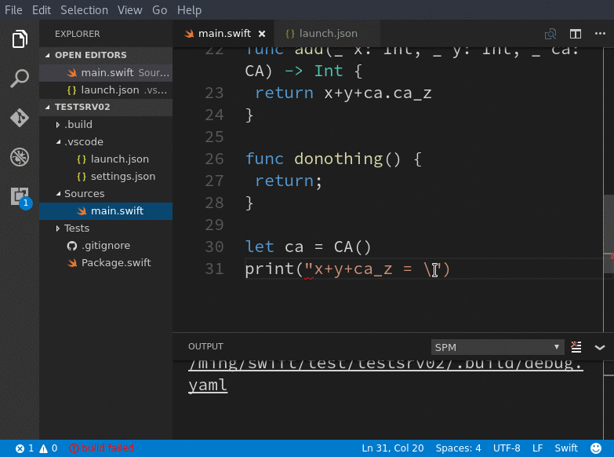

# Swift Development Environment

     

## 2.0 Release Broadcast
The `2.0` release introduces a new tool, [SourceKite](https://github.com/jinmingjian/sourcekite), as the interface to **SourceKit** library. Since the Swift `ABI` is not stable, you need to build it if you want to use SDE. Go to [sourcekite](https://github.com/jinmingjian/sourcekite) for further instructions.

Also because the Swift ABI **is not stable**, you may find that the _Hover Help_ or the _Code Completion_ don't display the right information after you upgrade your Swift toolchain. This is because the SourceKit library you linked with the [SourceKite](https://github.com/jinmingjian/sourcekite) tool can't understand the sources or binaries of your project. To fix this, **rebuild your project** and **restart vscode**.

#### Want to downgrade?
If the release broke your current experience or if you accidentally upgraded, you can go back to the previous releases like this: 

1. Download the 1.x vsix from [the release page](https://github.com/jinmingjian/sde/releases)
2. Remove the installed version in your vscode
3. Install the local `.vsix` package in your vscode

#### Version history
Can be seen in [CHANGELOG](CHANGELOG.md).

## Quick Preview

You can read a [hands-on introduction](http://blog.dirac.io/2017/01/11/get_started_sde.html) for a detailed explanation.

## Project Status
The project focuses on making the following features solid:
* Code completion
* Formatting
* Error diagnosis
* Debugging
* Navigation/hyperlinking
* Hover help
* SPM support/preferences/tools

Read more of the big picture in [the wiki](https://github.com/jinmingjian/sde/wiki)

The initial goal of this project was to give myself a joyful Swift coding experience in Linux. But with the help of community, the macOS support has become as strong as it is in Linux. I hope it can drive you to start a joyful coding experience for server side Swift at Linux and macOS. *(Or if you like, try it on Windows 10 WSL)*

The current work for this project is done in the free time of the author for his love to **swift@linux**. Therefore, it is best _(at the moment)_ to focus the limited resources on the most important functionalities. That said, your ideas are always welcome. 

## Usage

### Installation

  - Just search "sde" and install from your vscode's _Extensions_ view.

### Prerequisites

  - This project only depends on its companion project [sourcekite](https://github.com/jinmingjian/sourcekite), which transitively depends on the official Swift codebase and its companion-tool project [SourceKit library](https://github.com/apple/swift/tree/master/tools/SourceKit). Go to [sourcekite](https://github.com/jinmingjian/sourcekite) for more information.

  - Starting from 2.0, SDE is based on top of **Swift 3.1** and **vscode 1.8** (typescript 2.0 for development). You will be notified when these version dependencies are broken. _(**NOTE:** Swift 3.1 is intended to be source compatible with Swift 3, so you can develop with SDE and release with 3.0)_

### Other information

1. The dependence to `sourcekitd-repl` has been deprecated starting from release 2.0.   

  1. The extension in the marketplace will be rolling-updated in a timed rhythm, such as some weeks. Also, there is no semantic versioning or backward compatibility guaranteed yet. It is better to check the changelog before your update.

## Contributors
[Jin Mingjian](mailto:jin.phd@gmail.com): [twitter](https://twitter.com/JinMingjian)

## FAQ

### Is it possible to use SDE if I can't build sourcekite in my Linux setup, in absence of sourcekit library?

Strictly speaking, we should wait for the sourcekit library to be included in the official download. From _2.0.20170209_ though, SDE makes a sourcekite docker image and adds a new experimental setting `"swift.path.sourcekiteDockerMode"` for easier adoption for Linux users. Go to [sourcekite](https://github.com/jinmingjian/sourcekite) for more information.

### Why don't you contribute to the existing projects?

Current such works are all naïve to attract linux/backend users to embrace concise and elegant Swift. I am watching the communities of vscode and Swift to provide the best experience with my best effort. 

I also highly suggest the work of community (vscode & SwiftLang) should be joint. But I hope we can all be in good terms. 

### How to contribute to this project?

Any feedback helps.

If you mean contributions to the **sources**, this is truely another topic. The experience of **_using_** an editor is much different than that of **_developing_** one. It might be a bit more painful than you think. But if you would like to, welcome! 

There aren't too much documents about the development of this project. If you have any questions or interests, don't hesitate to file an issue _(better than a private email)_. I will help you and then drop more readings as time goes by. This is **_the way of "open source"_**. 

### Why can't I debug my executable, built by SPM in my Linux installation?
   
Watch [this SR](https://bugs.swift.org/browse/SR-3280) for more and then you would be easy to dig out some workaround although there are still other problems.

### It seems diagnostic info is not available at all?

Did you build your project yet? Try it. Then, you can see below for a detailed explanation.

### It seems diagnostic infos are only available after building?
  
Yes. Not only the diagnostic infos, the current design and implementations are convention-based, like SPM itself. This is still far from the perfect. However, it is enough for many cases although not flexible for covering 100%. There are many reasons for this, such as, limited development resources, bugs in Sourcekit tools or the lacks of understanding to current Sourcekit protocol. I'd like to continue to improve the experience.

## Other questions?

If so, file an [issue](https://github.com/jinmingjian/sde/issues), please :)

## License
Apache License v2.

## 3rd-party Sources Thanks 
1. [dbgmits](https://github.com/enlight/dbgmits), very nice structure of sources, but of which in my heavy modification to support non-MI and much more
